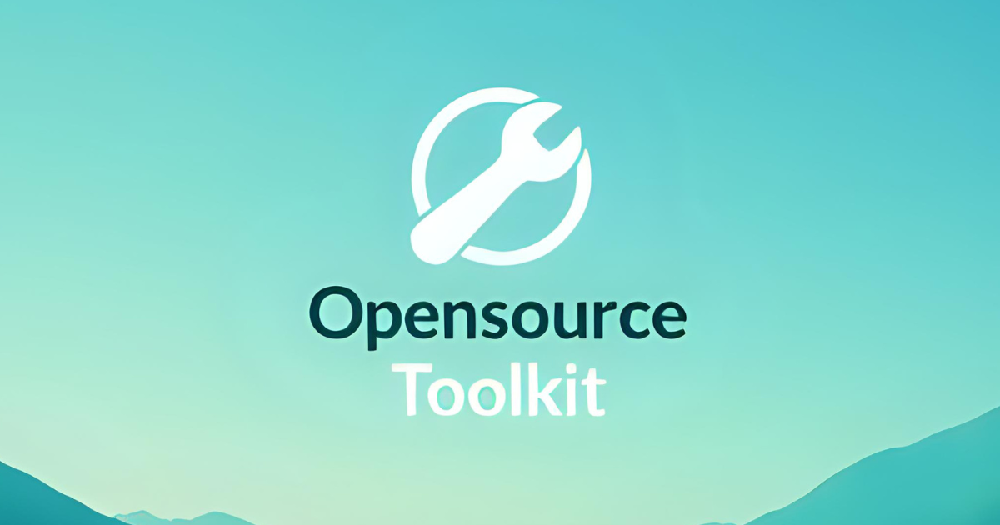

# 🧰 My Toolkit

A modern, comprehensive collection of developer and utility tools built with Next.js 15, React 19, and TypeScript. Designed for developers, security professionals, and anyone who needs reliable, fast, and secure utility tools.



## 🚀 Tech Stack

### Core Technologies

- **[Next.js 15](https://nextjs.org/)** - React framework with App Router
- **[React 19](https://react.dev/)** - Latest React with modern features
- **[TypeScript](https://www.typescriptlang.org/)** - Type-safe development
- **[Tailwind CSS](https://tailwindcss.com/)** - Utility-first CSS framework

### UI & Components

- **[Radix UI](https://www.radix-ui.com/)** - Headless, accessible components
- **[shadcn/ui](https://ui.shadcn.com/)** - Beautiful, reusable components
- **[Lucide React](https://lucide.dev/)** - Beautiful & consistent icons

### State & Data Management

- **[Zustand](https://zustand-demo.pmnd.rs/)** - Lightweight state management
- **[TanStack Query](https://tanstack.com/query)** - Powerful data synchronization
- **[Axios](https://axios-http.com/)** - HTTP client

### Development Tools

- **[ESLint](https://eslint.org/)** - Code linting
- **[Prettier](https://prettier.io/)** - Code formatting
- **[Husky](https://typicode.github.io/husky/)** - Git hooks
- **[Turbopack](https://turbo.build/pack)** - Ultra-fast bundler

## 🛠️ Getting Started

### Prerequisites

- Node.js 18+
- npm or yarn or pnpm

### Installation

1. **Clone the repository**

   ```bash
   git clone https://github.com/truethari/OpensourceToolkit.git
   cd opensourcetoolkit
   ```

2. **Install dependencies**

   ```bash
   npm install
   # or
   yarn install
   # or
   pnpm install
   ```

3. **Start the development server**

   ```bash
   npm run dev
   # or
   yarn dev
   # or
   pnpm dev
   ```

4. **Open your browser**
   ```
   http://localhost:5001
   ```

### Build for Production

```bash
npm run build
npm run start
```

## 📁 Project Structure

```
opensourcetoolkit/
├── src/
│   ├── app/                    # Next.js App Router
│   │   ├── (tools)/           # Grouped tool routes
│   │   ├── layout.tsx         # Root layout
│   │   └── page.tsx           # Home page
│   ├── components/
│   │   ├── ui/                # shadcn/ui components
│   │   ├── tools/             # Tool-specific components
│   │   ├── general/           # Navigation & layout
│   │   └── wrappers/          # Layout wrappers
│   ├── config/                # Tool configuration
│   ├── hooks/                 # Custom React hooks
│   ├── lib/                   # Utility libraries
│   ├── providers/             # React providers
│   ├── types/                 # TypeScript definitions
│   └── utils/                 # Utility functions
├── public/                    # Static assets
│   ├── seo/                   # SEO images
│   ├── sitemap.xml           # Auto-generated sitemap
│   └── robots.txt            # Search engine directives
├── components.json           # shadcn/ui config
├── tailwind.config.ts        # Tailwind configuration
└── next.config.ts           # Next.js configuration
```

## 🎯 Available Tools

| Tool                    | Description                                    | Route                 | Features                                            |
| ----------------------- | ---------------------------------------------- | --------------------- | --------------------------------------------------- |
| **Password Generator**  | Advanced password, passphrase & PIN generation | `/password-generator` | Security analysis, batch generation, custom presets |
| **JWT Tool**            | JWT encoding, decoding & verification          | `/jwt`                | Multi-algorithm support, security validation        |
| **UUID Generator**      | Generate unique identifiers                    | `/uuid`               | V1 & V4 UUIDs, batch generation                     |
| **Timestamp Converter** | Convert between timestamp formats              | `/timestamp`          | Live time, batch conversion, multiple formats       |
| **Text Case Converter** | Transform text cases                           | `/text-converter`     | 10+ case types, batch processing                    |
| **Image Converter**     | Convert image formats                          | `/image-converter`    | PNG/JPEG/GIF/WebP, optimization                     |
| **Folder Analyzer**     | Analyze directory structures                   | `/folder-analyzer`    | Tree visualization, multi-format export             |

## 🔧 Scripts

```bash
npm run dev          # Start development server (port 5001)
npm run build        # Build for production
npm run start        # Start production server
npm run lint         # Run ESLint
npm run format       # Format code with Prettier
npm run test         # Run lint and format checks
```

## 🌟 Key Features

### 🎨 Modern UI/UX

- **Dark theme** by default with beautiful gradients
- **Responsive design** that works on all devices
- **Accessible components** built with Radix UI
- **Consistent design system** with Tailwind CSS

### ⚡ Performance

- **Next.js 15** with App Router for optimal performance
- **Turbopack** for lightning-fast development builds
- **Optimized bundles** and automatic code splitting
- **SEO optimized** with automated sitemaps

### 🔒 Security & Privacy

- **Client-side processing** - your data never leaves your browser
- **No tracking** of user inputs or generated data
- **Secure algorithms** for cryptographic operations
- **Best practices** for password and security tools

### 🛡️ Developer Experience

- **Full TypeScript** support with strict typing
- **ESLint & Prettier** for code quality
- **Git hooks** with Husky for pre-commit checks
- **Component composition** patterns

## 🤝 Contributing

We welcome contributions! Here's how you can help:

### Adding New Tools

1. Create a new component in `src/components/tools/your-tool/`
2. Add the route in `src/app/(tools)/your-tool/page.tsx`
3. Register the tool in `src/config/index.ts`
4. Follow the existing patterns for SEO and styling

### Development Guidelines

- Follow the existing code style (ESLint + Prettier)
- Write TypeScript with proper types
- Use the established component patterns
- Test your tools thoroughly
- Update documentation as needed

### Submitting Changes

1. Fork the repository
2. Create a feature branch (`git checkout -b feature/amazing-tool`)
3. Commit your changes (`git commit -m 'Add amazing tool'`)
4. Push to the branch (`git push origin feature/amazing-tool`)
5. Open a Pull Request

## 📝 License

This project is licensed under the **MIT License** - see the [LICENSE](LICENSE) file for details.

## 🙏 Acknowledgments

- **[shadcn](https://twitter.com/shadcn)** for the amazing UI components
- **[Radix UI](https://www.radix-ui.com/)** team for accessible primitives
- **[Vercel](https://vercel.com/)** for Next.js and deployment platform
- **[Tailwind CSS](https://tailwindcss.com/)** team for the utility framework

## 📊 Project Stats

- **7 Tools** currently available
- **16 UI Components** in the design system
- **100% TypeScript** codebase
- **SEO optimized** for all tools
- **Mobile responsive** design
- **0 external API calls** for privacy

## 🔗 Links

- **[Live Demo](https://opensourcetoolkit.com)** - Try the tools online
- **[Issue Tracker](https://github.com/truethari/OpensourceToolkit/issues)** - Report bugs or request features
- **[Discussions](https://github.com/truethari/OpensourceToolkit/discussions)** - Community discussions

---

<div align="center">

**Built with ❤️ by the community, for the community**

⭐ **Star this repo** if you find it useful!

</div>
